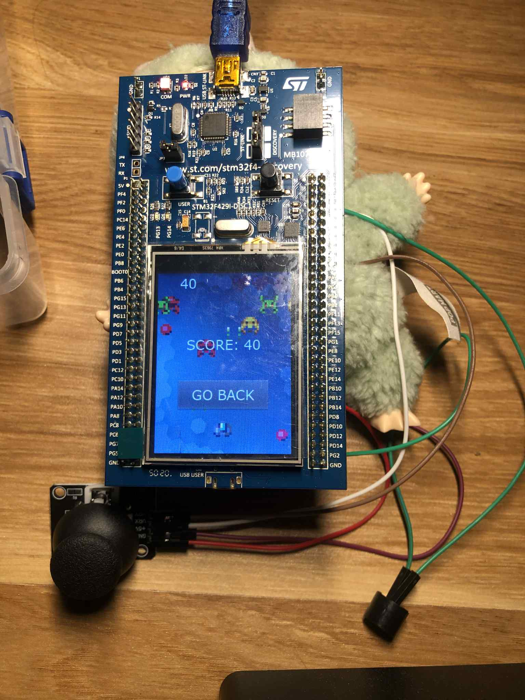

# GAME GALAGA

Nội dung cần báo cáo của môn đồ án:

> "Mô phỏng trò chơi Galaga, sử dụng joystick để điều khiển.
> Yêu cầu:
>
> - Dùng hardware random generator để sinh quái ngẫu nhiên.
> - Có âm thanh phát ra bằng còi buzzer."

## GIỚI THIỆU

**Đề bài**: _Mô phỏng trò chơi Galaga_

**Sản phẩm:**

1. Di chuyển 4 hướng bằng Joystick.
2. Tích luỹ điểm khi tiêu diệt quái, kết thúc khi trò chơi vượt quá giới hạn 3 mạng khi tàu bị bắn trúng hoặc va phải quái.
3. Tạo ra quái vị trí ngẫu nhiên.
4. Phát ra âm thanh và sáng led LD3 khi tiêu diệt quái.

- Ảnh chụp minh họa:\
  

## TÁC GIẢ

- Tên nhóm: 9h53
- Thành viên trong nhóm
  |STT|Họ tên|MSSV|Công việc|
  |--:|--|--|--|
  |1|Nguyễn Tấn Dũng|20225293|Xử lý logic tiêu diệt quái, điểm số, số mạng, điều khiển di chuyển bằng joystick, kết nối còi buzeer và led LD3 khi tiêu diệt quái|
  |2|Phan Đình Can|20210108|Tạo giao diện game, tạo quái hiển thị ngẫu nhiên, kết nối joystick|

## MÔI TRƯỜNG HOẠT ĐỘNG

- Sử dụng vi điều khiển STM32F429-DISC (cụ thể STM32F429ZIT6).
- Sử dụng joystick, còi buzzer.

## SƠ ĐỒ SCHEMATIC

_Cách nối dây, kết nối giữa các linh kiện_
|STM32F429|Joystick|Còi buzzer|
|--|--|--|
|3.3V|VCC||
|GND|GND|GND|
|PA1|VRx|
|PA2|VRy|
|PG13||VCC (led trên board)|

### TÍCH HỢP HỆ THỐNG

- Thành phần phần cứng:

| Thành phần | Vai trò                                                      |
| ---------- | ------------------------------------------------------------ |
| STM32F429  | Xử lý logic trò chơi, điều khiển ngoại vi, tạo số ngẫu nhiên |
| Joystick   | Điều khiển tàu (4 hướng)                                     |
| Còi buzzer | Tạo âm thanh khi tiêu diệt quái                              |

- Thành phần phần mềm:

| Thành phần | Vai trò                                                    |
| ---------- | ---------------------------------------------------------- |
| Firmware   | Điều khiển trò chơi, xử lý joystick, buzzer, màn hình, RNG |
